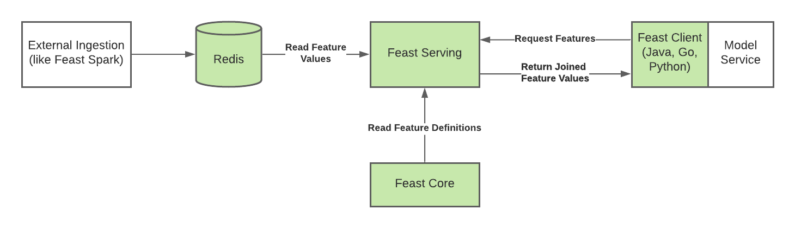

# Feast Java components

## Overview

This repository contains the following Feast components
* Feast Core: The central feature registry used to define and manage entities and features
* Feast Serving: A service used to serve the latest feature values to models
* Feast Java SDK: A client used to retrieve features from Feast Serving
* Helm Charts: The repository also contains Helm charts to deploy Feast Core and Feast Serving into a Kubernetes cluster

# Architecture

